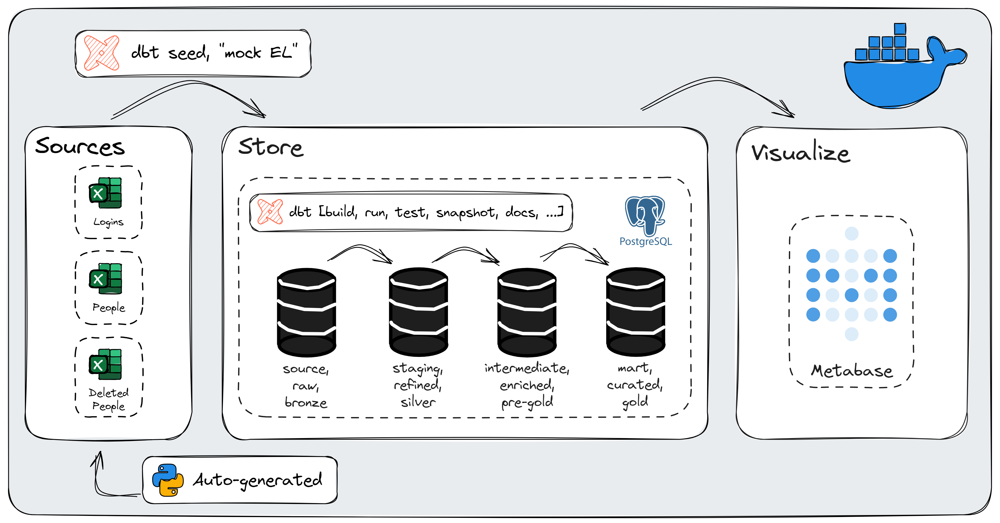

# 🌟 dbt from scratch

> A local end-to-end, containerized data engineering project that leverages open-source technology to generate, transform, load and visualize data. Everything runs on `Docker` with official images and `Dev Containers`.
> 



# 1️⃣ Introduction

What we will use:

- `Docker` to containerize our application.
- A slim Python `devcontainer` with some configurations to skip the need to install anything locally.
- `dbt` to transform data. We’ll also mock EL with Python scripts and the `dbt seed` command.
- An official `PostgreSQL` image as our open-source relational database (mock-DWH). Easiest to setup with `dbt` as it has an official provider.
- `DBeaver` as database UI. Other options could be `psql` (CLI), `adminer` or `pgAdmin`.
- `Metabase` as our open-source, free and self-hosted on `Docker` visualization tool.

What we won’t use but might add:

- An orchestrator/workflow scheduler. Examples of this would be the paid `dbt Cloud` offering, `Azure Data Factory`, `Airflow`, `Prefect`, `Dagster`, `Cron jobs`, `Kestra`, `Databricks workflows`. We won’t use this because they either cost money or are too complex to setup properly for a local project. In a real-life scenario, most probably as a consultant, `dbt Cloud` would be used. I might add open-source `Dagster` in the future.
- `git` can be added whenever you want, but it won’t be part of this project to add it.
- More interesting data sources, either by using datasets from `Kaggle`, or using free APIs.
- CI/CD.

Prerequisites to follow along:

- `Docker Desktop` up and running.

## 🤔 What `dbt` is → the T in ELT

`dbt` typically refers to a popular open-source analytics engineering tool called `dbt` (short for "data build tool"). `dbt` is designed to help analysts and data engineers transform data in their warehouse more effectively. It enables data analysts to write SQL queries, transformations, and models in a modular and version-controlled way.

Key features of `dbt` include:

1. **Modularization:** `dbt` promotes a modular (DRY) approach to writing SQL queries. Analysts can create reusable SQL files (called `models`) for specific business logic or data transformations.
2. **Version Control:** `dbt` allows you to version control your SQL code, making it easier to track changes over time and collaborate with others.
3. **Dependency Management:** `dbt` understands the dependencies between different models, making it easier to manage the execution order of transformations.
4. **Testing:** `dbt` includes a testing framework that allows analysts to write tests for their data models, ensuring data quality and consistency.
5. **Documentation:** `dbt` generates documentation for your data models automatically, making it easier for team members to understand the structure and purpose of different datasets.
6. **Execution:** `dbt` can execute SQL queries and transformations directly in your data warehouse, such as BigQuery, Snowflake, or Redshift.

Overall, `dbt` is part of the modern data stack and is often used in conjunction with other tools like data warehouses, BI tools, and orchestration tools to build scalable and maintainable data analytics pipelines. `dbt` also offers, as many other OS tools, a managed cloud service that enhances the `dbt` experience with scheduling capabilities, easier connection setups, a web-based UI, etc. 

## 🕵️ Who is it for?

`dbt` has “its own” title for their target audience, Analytics Engineer which places itself between Data Engineers and Data Analysts.

 


## 📟 `dbt` commands

`dbt` includes a number of commands to manipulate data and the underlying data warehouse. What is central to know about `dbt` is that data is always assumed to exist in an underlying data warehouse. At its core, `dbt` is a number of `SELECT` statements, that compiles into whatever `SQL` dialect the underlying data warehouse uses for DDL and DML queries. Here are a number of central commands:

### `dbt seed`

The `dbt seed` command will load `csv` files located in the `seed-paths` directory of your dbt project into your [data warehouse](https://docs.getdbt.com/terms/data-warehouse).

### `dbt run`

`dbt run` executes compiled `sql` model files against the current `target` database. dbt connects to the target database and runs the relevant SQL required to materialize all data models using the specified [materialization](https://docs.getdbt.com/terms/materialization) strategies. Models are run in the order defined by the dependency graph generated during compilation. Intelligent multi-threading is used to minimize execution time without violating dependencies.

### `dbt test`

`dbt test` runs tests defined on models, sources, snapshots, and seeds. It expects that you have already created those resources through the appropriate commands and specified tests in `yml` files.

### `dbt snapshot`

`dbt` provides a mechanism, `snapshots`, which records changes to a mutable [table](https://docs.getdbt.com/terms/table) over time. `snapshots` implement [type-2 Slowly Changing Dimensions](https://en.wikipedia.org/wiki/Slowly_changing_dimension#Type_2:_add_new_row) over mutable source tables. These Slowly Changing Dimensions (or SCDs) identify how a row in a table changes over time.

### `dbt docs`

`dbt docs` has two supported subcommands: `generate` and `serve`. `generate` is responsible for generating your project's documentation, and `serve` starts a webserver on port 8080 to serve your documentation locally and opens the documentation site in your default browser.

### `dbt build`

The `dbt build` command will:

- run models
- test tests
- snapshot snapshots
- seed seeds

in DAG order, for selected resources or an entire project.

### `dbt source [freshness]`

If your dbt project is [configured with sources](https://docs.getdbt.com/docs/build/sources), then the `dbt source freshness` command will query all of your defined source tables, determining the "freshness" of these tables. If the tables are stale (based on the `freshness` config specified for your sources) then dbt will report a warning or error accordingly. Good to know is that this command is ********not******** run with `dbt build`.

### `dbt compile`

`dbt compile` generates executable SQL from source `model`, `test`, and `analysis` files. You can find these compiled SQL files in the `target/` directory of your dbt project. `dbt compile` is *not* a pre-requisite of `dbt run`, or other building commands. Those commands will handle compilation themselves. If you just want dbt to read and validate your project code, without connecting to the data warehouse, use `dbt parse` instead.

### `dbt deps`

`dbt deps` pulls the most recent version of the dependencies listed in your `packages.yml` from git.

### `dbt debug`

`dbt debug` is a utility function to test the database connection and display information for debugging purposes, such as the validity of your project file and your installation of any requisite dependencies (like `git` when you run `dbt deps`).

# 2️⃣ Init

Open a terminal in a development folder, and create a folder that our project will live in. Change into that directory and start the `Docker` initialization. This will create three files for us, and we will overwrite two of them. We will get a `.dockerignore` file for free.

```bash
mkdir consid_dbt && \
cd consid_dbt && \
mkdir .devcontainer && \
touch .devcontainer/devcontainer.json && \
touch requirements.txt && \
docker init
```

Hit enter, selecting “Other”. Open directory with `vscode` here.

```bash
code .
```

Since `dbt` is a Python package, all we need is a simple Python image to run it. Edit the `Dockerfile` with this content.

```docker
#Dockerfile

FROM mcr.microsoft.com/vscode/devcontainers/python:3.10

WORKDIR /usr/src/consid_dbt

ARG USER_UID=1000
ARG USER_GID=$USER_UID
RUN if [ "$USER_GID" != "1000" ] || [ "$USER_UID" != "1000" ]; then \
        groupmod --gid $USER_GID vscode \
        && usermod --uid $USER_UID --gid $USER_GID vscode; \
    fi

COPY requirements.txt /tmp/pip-tmp/

RUN pip3 --disable-pip-version-check \
        --use-deprecated=legacy-resolver \
        --no-cache-dir \
        install -r /tmp/pip-tmp/requirements.txt && \
        rm -rf /tmp/pip-tmp

ENV DBT_PROFILES_DIR=/usr/src/consid_dbt/dbt_project
```

Edit the `compose.yml` with this:

```yaml
version: "3.9"

services:
  consid_postgres:
    container_name: consid_postgres
    image: postgres:15.2-alpine
    environment:
      - POSTGRES_PASSWORD=postgres
    ports:
      - "5432:5432" # postgresql ports
      - "3000:3000" # metabase ports
    healthcheck:
      test: ["CMD-SHELL", "pg_isready -U postgres"]
      interval: 5s
      timeout: 5s
      retries: 5
    volumes:
      - consid_dbt:/var/lib/postgresql/data

  consid_dbt:
    container_name: consid_dbt
    build:
      context: .
      dockerfile: Dockerfile
      args:
        # On Linux, you may need to update USER_UID and USER_GID below 
        # if not your local UID is not 1000.
        USER_UID: 1000
        USER_GID: 1000
    image: consid_dbt
    volumes:
      - .:/usr/src/consid_dbt:cached
    depends_on:
      consid_postgres:
        condition: service_healthy
    # Overrides default command so things don't shut down after the process ends.
    command: sleep infinity
    
    # Runs app on the same network as the database container, allows "forwardPorts" in devcontainer.json function.
    network_mode: service:consid_postgres

    # Uncomment the next line to use a non-root user for all processes.
    user: vscode

  consid_metabase:
    image: metabase/metabase
    container_name: consid_metabase
    network_mode: service:consid_postgres

volumes:
  consid_dbt:
```

This file will tell `Docker` to create three services for us within one group, the PostgreSQL database, the Python image with `dbt` package installed and Metabase. What’s important to note here is:

- `volumes` → this makes sure we persist data even if the restart the container.
- `network_mode` → this allows us to run every service on the same network as the database.

Edit the `requirements.txt` with this:

```python
sqlfluff==2.3.5 # A linting tool that is promoted by dbt Labs.
sqlfluff-templater-dbt==2.3.5   # An extension to the sqlfluff package \
                                # that interprets dbt templating correctly.
dbt-postgres==1.7.2 # Installs dbt-core and dbt-postgres adapter.
pandas==2.1.3 # Used in mock Python scripts.
```

`sqlfluff` is a linting tool that works great with `dbt` . `dbt-postgres` will also install `dbt-core` and `pandas` is used in some Python scripts later on. 

Edit the `devcontainer.json` with this (don’t forget to uncomment the `git` line if initialized):

```json
// Update the VARIANT arg in docker-compose.yml to pick a Python version: 3, 3.8, 3.7, 3.6
{
    "name": "consid_dbt",
    "dockerComposeFile": "../compose.yaml",
    "service": "consid_dbt",
    "workspaceFolder": "/usr/src/consid_dbt",
    "customizations": {
        "vscode": {
            "settings": {
                "terminal.integrated.defaultProfile.linux#": "/bin/zsh",
                "python.pythonPath": "/usr/local/bin/python",
                "python.languageServer": "Pylance",
                "files.associations": {
                    "*.sql": "jinja-sql"
                },
                "sqltools.connections": [
                    {
                        "name": "Database",
                        "driver": "PostgreSQL",
                        "previewLimit": 50,
                        "server": "localhost",
                        "port": 5432,
                        "database": "postgres",
                        "username": "postgres",
                        "password": "postgres"
                    }
                ],
                "sql.linter.executablePath": "sqlfluff",
                "sql.format.enable": false
            },
            "extensions": [
                "bastienboutonnet.vscode-dbt",
                "dorzey.vscode-sqlfluff",
                "editorconfig.editorconfig",
                "innoverio.vscode-dbt-power-user",
                "ms-azuretools.vscode-docker",
                "ms-python.python",
                "ms-python.vscode-pylance",
                "visualstudioexptteam.vscodeintellicode",
                "eamodio.gitlens",
                "mtxr.sqltools-driver-pg",
                "mtxr.sqltools",
                "redhat.vscode-yaml",
                "samuelcolvin.jinjahtml"
            ]
        }
    },
    // Uncomment the if git is initialized.
    //"initializeCommand": "git submodule update --init",
    "remoteUser": "vscode"
}
```

A `Dev Container` typically refers to a development environment that is containerized using technologies like `Docker`. This approach aims to provide a consistent and reproducible development environment across different machines and for different developers. Above will install some extensions that is handy in vscode inside the container. It also sets up a connection to the PostgreSQL database inside the `SQLTools` extension.

All done! Open a terminal and type:

```bash
docker compose build && docker compose up -d
```

This will create a container, with three containers inside. One is our database, and one is a `Python3.10` image with `dbt-core` + `dbt-postgres` adapter installed. The last one will be our visualization tool `Metabase`.

To start working inside the container, where `dbt` is installed, we can utilize our pre-configured `devcontainer.json` file to “Reopen in container”. Hit `ctrl+shift+p` and search for this.

# 3️⃣ `dbt` setup

Now it’s time to let `dbt` do some scaffolding for us. We will create a new `dbt` project inside the current directory, called `dbt_project`. This will create a new project inside a subdirectory named what we call the project. The default location for `profiles.yml` is at `~/.dbt` which is good for local projects, but then each developer needs to place this file outside of the repository on their local machine. By excluding it from the initialization (with the flag `--skip-profile-setup`) and adding it manually inside the repo (and using `jinja` to inject variables from an `.env` file not to expose sensitive values) we make it possible to share this project with anyone easily. However, the credentials is not sensitive here so we will not hide them.

```bash
dbt init dbt_project --skip-profile-setup && \
cd dbt_project && \
touch profiles.yml && \
touch packages.yml
```

This sets up `dbt` to connect to our PostgreSQL. Paste this into the `profiles.yml`: 

```yaml
# profiles.yml

consid_dbt:
  target: dev
  outputs:
    dev:
      type: postgres
      host: consid_postgres
      user: postgres
      password: postgres
      port: 5432
      dbname: postgres
      schema: staging
      threads: 1
```

Paste this into the `dbt_project.yml`:

```yaml
#dbt_project.yml

name: 'consid_dbt'
version: '1.0.0'
config-version: 2

profile: 'consid_dbt'

model-paths: ["models"]
analysis-paths: ["analyses"]
test-paths: ["tests"]
seed-paths: ["seeds"]
macro-paths: ["macros"]
snapshot-paths: ["snapshots"]

clean-targets:         # directories to be removed by `dbt clean`
  - "target"
  - "dbt_packages"

models:
  consid_dbt:
    staging:
      +materialized: view
    intermediate:
      +materialized: ephemeral
    marts:
      +materialized: table

seeds:
  consid_dbt:
    +schema: login_service
```

And this on `packages.yml` with this:

```yaml
#packages.yml

packages:
  - package: dbt-labs/dbt_utils # Handy macros, such as surrogate key generatorors
    version: 1.1.1
  - package: calogica/dbt_date # Handy date creation macros
    version: 0.10.0
```

Test the connection to our `PostgreSQL` container by running:

```bash
dbt debug
```

If `dbt` complains about not finding the `profiles.yml` and `dbt_project.yml` try changing the environment values as:

```bash
export DBT_PROFILES_DIR=/usr/src/consid_dbt/dbt_project && \
export DBT_PROJECT_DIR=/usr/src/consid_dbt/dbt_project
```

Install packages as defined in the `packages.yml`:

```bash
dbt deps
```

## 🌱 Seeds

Right now our repo doesn’t look like much. Let’s create `seeds`.

`dbt seed` is an easy way to populate data that typically don’t change, are not part of any source and would help in semantically clarify other data. Some great examples of this are `dim_date` tables, `country_code` tables, or `zipcode` mapping tables. These are used often in analysis but never change. Instead of manually creating them as a `dbt` data model, it makes sense to reuse a publicly available file and ingest it into your warehouse. This way, you aren’t making more work for yourself! A good example would be the table `state_codes` as below:

```yaml
+------+------------+
| code | state      |
+------+------------+
| AL   | Alabama    |
| AK   | Alaska     |
| AZ   | Arizona    |
| AR   | Arkansas   |
| CA   | California |
+------+------------+
```

However, we will use it to mock an EL flow to our `bronze` layer. It will be a simple Python script that will act as an EL-tool, like Azure Data Factory, that fetches new `logins` from a source system and loads it into our `bronze` layer. This layer will be referenced to by `dbt` as a `source`.

## 📜 Scripts

Inside the `dbt` project, create a folder called scripts, one file called `login_generator_script.py` and one file called `people_generator_script.py`.

```bash
mkdir scripts && \
touch scripts/login_generator_script.py && \
touch scripts/people_generator_script.py
```

Paste the following script for the `login_generator_script.py`:

```python
#!/usr/bin/env python

import datetime
import pandas as pd
import random
import os
import uuid

def generate_login_data(iterated_date, num_rows):
    all_logins = []
    
    data = {
        "id": [str(uuid.uuid4()) for _ in range(num_rows)],
        "logintimestamp": [iterated_date for i in range(num_rows)],
        "dayofweek": [iterated_date.isoweekday() for i in range(num_rows)],
        "userid": [random.randint(1, 4) for _ in range(num_rows)]
    }
    all_logins.append(data)
    
    return pd.concat([pd.DataFrame(data) for data in all_logins], ignore_index=True)

def main():
    
    # Set the working directory to the script's directory
    os.chdir(os.path.dirname(os.path.abspath(__file__)))

    # File to store the data
    csv_file = "../seeds/raw_logins.csv"

    # Get the start date from the last recorded date in the CSV file
    if os.path.exists(csv_file):
        df_existing = pd.read_csv(csv_file)
        last_date = pd.to_datetime(df_existing['logintimestamp']).max()
        start_date = last_date + datetime.timedelta(days=1)
    else:
        # If the file doesn't exist, start from the specified date
        start_year_input = int(input("Enter starting year: "))
        start_month_input = int(input("Enter starting month: "))
        start_day_input = int(input("Enter starting day: "))
        start_date = datetime.datetime(start_year_input, start_month_input, start_day_input)
        
    # Generate login data for each day in selected range, defaults to 7 days.
    range_input = input("Enter the number of days to generate logins for: ")
    range_value = int(range_input) if range_input.isdigit() else 7
    
    num_rows_input = input("Enter the number of logins to generate for each day: ")
    num_rows_value = int(num_rows_input) if num_rows_input.isdigit() else 10
    
    period = [i for i in range(range_value)]
    week_df = pd.DataFrame()
    for day in period:
        iterated_date = start_date + datetime.timedelta(days=day)
        num_rows = random.randint(1, num_rows_value)
        df = generate_login_data(iterated_date, num_rows)
        week_df = pd.concat([week_df, df])

    # Append the data to the CSV file
    week_df.to_csv(csv_file, mode='a', header=not os.path.exists(csv_file), index=False)
    generated_rows = len(week_df)
    print(f"Generated {generated_rows} logins for {range_value} days.")

if __name__ == "__main__":
    main()
```

Note on above: If the syntax highlighter doesn’t start, try reloading the vscode window.

And this for `people_generator_script.py`:

```python
#!/usr/bin/env python

import pandas as pd
import datetime
import os

data = {
    "id": [1,2,3,4],
    "firstname": ["Jakob", "Stefan", "Rami", "Therese"],
    "lastname": ["Agelin", "Verzel", "Moghrabi", "Olsson"],
    "created_at": [None for _ in range(4)],
    "updated_at": [None for _ in range(4)],
    "deleted_at": [None for _ in range(4)]
}

# Set the working directory to the script's directory
os.chdir(os.path.dirname(os.path.abspath(__file__)))

# File to store the data
csv_file = "../seeds/raw_people.csv"

# Check if the file already exists
file_exists = os.path.isfile(csv_file)

# Load existing data from the CSV file
existing_data = pd.read_csv(csv_file, keep_default_na=True) if file_exists else pd.DataFrame()

df = pd.DataFrame(data)
now = str(datetime.datetime.now())

# Set created_at timestamp only if the file is new
if not file_exists:
    df['created_at'] = now
    df['updated_at'] = now
    df.to_csv(csv_file, index=False)
    
# Check if row exists in the source file and update updated_at
if not existing_data.empty and pd.Series(df['id']).isin(existing_data['id']).any():
    df = pd.DataFrame(existing_data)
    rows_to_update = (df["deleted_at"].isnull()).sum()
    df.loc[df["deleted_at"].isnull(), 'updated_at'] = now
    df.to_csv(csv_file, index=False)
    print(f" Updated {rows_to_update} rows.")
else:
    print(f" Added {len(df)} rows.")
```

Run both scripts once. By using `chmod` (change mode) in bash, we change the permission for this file with `x` meaning it can get executed by just stating the file name. We could run it anyway with `python3 some_script.py` but this good to know.

```python
chmod +x scripts/login_generator_script.py && \
scripts/login_generator_script.py && \
chmod +x scripts/people_generator_script.py && \
scripts/people_generator_script.py
```

Tip! When opening the csv files, vscode suggests to install an extension, the Rainbow CSV extension. Go to this extension and click “add to devcontainer.json”, to keep this extension installed for everyone using the same `Dev Container`.

## 🤖 Default schema macro

A note on how `dbt` handles schemas. The default schema is set in the `profiles.yml` file. This is the schema that `dbt` writes to if no custom schema is supplied via a config block or in the `dbt_project.yml`. The default behavior of supplying a default schema is that `dbt` concatenates the default and custom as `<target_schema>_<custom_schema>`. More on this [here](https://docs.getdbt.com/docs/build/custom-schemas). When developing alone and locally we can remove this behavior by adding a macro in our macros folder, overriding this default behavior.

Create a macro file called `generate_schema_name.sql`.

```bash
touch macros/generate_schema_name.sql
```

Add this code.

```sql


    
    

        {{ default_schema }}

    

        {{ custom_schema_name | trim }} 

    


```

Now, run `dbt seed`.

```bash
dbt seed
```

Important to know is that the compiled query can be viewed at `target/run/consid_dbt/seeds` for each seed. There we can see that each seed is run with `TRUNCATE` first (if it doesn’t exist). We will only see the latest run here. Open the file `raw_logins.csv` in above path, and then run `dbt seed` one more time, and when the run finishes, the file will change DML statement from `CREATE TABLE` to `TRUNCATE TABLE`. This can also be viewed in the `dbt.log` file.

If we need to change schema of our source data, with seeds, we can add the `-f` flag for a full-refresh of the target table. In this case, as we can see in the logs, we can see that the statement then changes from `TRUNCATE` to `DROP TABLE IF EXISTS`.

```bash
dbt seed -f
```

Login to `DBeaver` and see the results with a query.

```sql
SELECT id, firstname, lastname, created_at, updated_at, deleted_at
FROM public.raw_people;
```

While we’re at it, also create a file called `generate_loaded_at_column.sql`. 

```bash
touch macros/generate_loaded_at_column.sql
```

We’re doing this to add a timestamp when we loaded the data into our warehouse with `dbt seed`. This is not an out-of-the-box functionality for `dbt` since this command is not meant to ingest source data into the warehouse. Note that the query here is PostgreSQL specific:

```sql

    
        
        
            DO $$ 
            BEGIN
                -- Check if the column already exists
                IF NOT EXISTS (
                    SELECT 1 
                    FROM information_schema.columns 
                    WHERE table_schema = '{{ node.schema }}' 
                    AND table_name = '{{ node.identifier }}' 
                    AND column_name = '_dbt_loaded_at'
                    ) 
                THEN
                    -- If not exists, then add the column
                    EXECUTE 'ALTER TABLE ' || quote_ident('{{ node.schema }}') || '.' || quote_ident('{{ node.identifier }}') || ' ADD COLUMN _dbt_loaded_at TIMESTAMP DEFAULT CURRENT_TIMESTAMP';
                END IF;
            END $$;
        
        {{ run_query(query) }}
    
    
    {# /* run below command to insert column for each seed */ #}
    {# /* dbt run-operation generate_loaded_at_column --args '{tables: [raw_logins, raw_people, raw_people_deleted]}' */ #}

```

Finally run this as a `dbt run-operation` (this is only needed once per `seed` post the first `dbt seed` run or subsequent runs with the `--full-refresh` flag):

```bash
dbt run-operation generate_loaded_at_column --args '{tables: [raw_logins, raw_people, raw_people_deleted]}'
```

## 🧊 Models and sources

A `model` is a `SELECT`-statement in `sql` that will compile into `DML` and `DDL` queries in the target data warehouse. They will create tables, views or nothing at all (ephemeral). `dbt` supports `Jinja templating`, and offers a modular approach to development in `sql`. A `source` is a table inside the data warehouse or lakehouse that already has been populated with data by another workflow. It is a reference to that raw table, and by specifying a `sources.yml` file we allow `dbt` to reference these sources when the code compiles, modularizing our code.

Let’s improve our `dbt` project with three layers → `staging`, `intermediate` and `marts`. `dbt` suggests the following structure:

```
jaffle_shop
├── README.md
├── analyses
├── seeds
│   └── employees.csv
├── dbt_project.yml
├── macros
│   └── cents_to_dollars.sql
├── models
│   ├── intermediate
│   │   └── finance
│   │       ├── _int_finance__models.yml
│   │       └── int_payments_pivoted_to_orders.sql
│   ├── marts
│   │   ├── finance
│   │   │   ├── _finance__models.yml
│   │   │   ├── orders.sql
│   │   │   └── payments.sql
│   │   └── marketing
│   │       ├── _marketing__models.yml
│   │       └── customers.sql
│   ├── staging
│   │   ├── jaffle_shop
│   │   │   ├── _jaffle_shop__docs.md
│   │   │   ├── _jaffle_shop__models.yml
│   │   │   ├── _jaffle_shop__sources.yml
│   │   │   ├── base
│   │   │   │   ├── base_jaffle_shop__customers.sql
│   │   │   │   └── base_jaffle_shop__deleted_customers.sql
│   │   │   ├── stg_jaffle_shop__customers.sql
│   │   │   └── stg_jaffle_shop__orders.sql
│   │   └── stripe
│   │       ├── _stripe__models.yml
│   │       ├── _stripe__sources.yml
│   │       └── stg_stripe__payments.sql
│   └── utilities
│       └── all_dates.sql
├── packages.yml
├── snapshots
└── tests
    └── assert_positive_value_for_total_amount.sql
```

Let’s use this, and start with `staging`:

```bash
mkdir models/staging && \
mkdir models/staging/login_service && \
touch models/staging/login_service/_login_service__models.yml && \
touch models/staging/login_service/_login_service__sources.yml && \
touch models/staging/login_service/stg_login_service__logins.sql && \
touch models/staging/login_service/stg_login_service__people.sql && \

mkdir models/staging/login_service/base && \
touch models/staging/login_service/base/base_login_service__people.sql && \
touch models/staging/login_service/base/base_login_service__deleted_people.sql
rm -r models/example
```

Update the `.yml` files:

```yaml
#_login_service__models.yml

version: 2

models:
  - name: stg_login_service__people
    description: Customer data
    columns:
      - name: people_id
        description: Primary Key
        tests:
          - unique
          - not_null

  - name: stg_login_service__logins
    description: Logins from people
    columns:
      - name: login_id
        description: Primary Key
        tests:
          - unique
          - not_null
```

```yaml
#_login_service__sources.yml

version: 2

sources:
  - name: login_service
    # schema is optional, as by default dbt uses name as schema
    # but we could if we want set another name for it
    #schema: consid
    description: Login data for the Login Service
    tables:
      - name: raw_people
        description: One record per person that has logged in
      - name: raw_logins
        description: One record per login that a person has made
        freshness:
          warn_after: {count: 24, period: hour}
        loaded_at_field: "logintimestamp::timestamp"
```

Paste this into `stg_login_service__logins.sql`:

```sql
--stg_login_service__logins.sql

with source as (

    select * from {{ source('login_service', 'raw_logins') }}

),

renamed as (
    select
        id::text as login_id,
        logintimestamp::date as date_key,
        userid as people_id
    from source
)

select * from renamed
```

Paste this into `stg_login_service__people.sql`:

```sql
--stg_login_service__people.sql

with people as (

    select * from {{ ref('base_login_service__people') }}
),

deleted_people as (

    select * from {{ ref('base_login_service__deleted_people') }}
),

join_and_mark_deleted_people as (

    select
        people.people_id,
        concat(people.firstname, ' ', people.lastname) as full_name,
        people.created_at,
        people.updated_at,
        deleted_people.is_deleted
        
    from people
    left join deleted_people on people.people_id = deleted_people.people_id
)

select * from join_and_mark_deleted_people
```

Paste this into `base_login_service__deleted_people.sql`:

```sql
--base_login_service__deleted_people.sql

with source as (

    select * from {{ source('login_service', 'raw_people_deleted') }}
),

deleted_customers as (

    select
        id as people_id,
        deleted as is_deleted
    from source
)

select * from deleted_customers
```

Paste this into `base_login_service__people.sql`:

```sql
--base_login_service__people.sql

with source as (

    select * from {{ source('login_service', 'raw_people') }}
),

renamed as (

    select
        id as people_id,
        firstname,
        lastname,
        created_at::timestamp,
        updated_at::timestamp
    from source
)

select * from renamed
```

## 🐇 `sqlfluff`

Notice how the `sqlfluff` plugin is complaining about a rule. It wants us to “Select wildcards then simple targets before calculations and aggregates”. Another default rule is to not allow a file to end without a empty new line. In this case I don’t want this specific rule to apply. Let’s change this behavior by adding a `.sqlfluff` file and add the following code to it.

```bash
touch ../.sqlfluff
```

```toml
[sqlfluff]
templater = dbt
dialect = postgres
exclude_rules = L034, L009

[sqlfluff:templater:jinja]
apply_dbt_builtins = True
load_macros_from_path = macros

# If using the dbt templater, we recommend setting the project dir.
[sqlfluff:templater:dbt]
project_dir = ./
profiles_dir = ./
profile = consid_dbt
target = dev

[sqlfluff:rules:ambiguous.column_references]  # Accept number in group by
group_by_and_order_by_style = implicit
```

Run the project to see the views created by `dbt`:

```bash
dbt run
```

View the compiled code and queries in either `target/` or `logs/`. Notice how `sqlfluff` complains about the compiled code inside target. Add a `.sqlfluffignore` file to the project:  

```bash
touch ../.sqlfluffignore
```

```
reports
target
dbt_packages
macros
```

## 🔜 Intermediate

The reason for an `intermediate` layer is to prepare `staging` data into `marts`. It could very well be `ephemeral` which means that they will not create any object in the target data warehouse - the query will only run as a CTE and is able to be reference by the `ref` command in `dbt`. It is beneficial to use a separate layer for these queries as it will reduce complexity of queries and promote modularity in the code.

Create the `intermediate` layer:

```bash
mkdir models/intermediate && \
touch models/intermediate/_int_marketing__models.yml && \
touch models/intermediate/int_logins_pivoted_to_people.sql && \
touch models/intermediate/int_logins_people_joined.sql && \
touch models/intermediate/int_logins_with_weekdays.sql
```

Paste this into `_int_marketing__models.yml`:

```yaml
#_int_marketing__models.yml

version: 2

models:
  - name: int_logins_pivoted_to_people
    description: Calculate the number of logins per people
    columns:
      - name: people_id
      - name: login_amount

  - name: int_logins_people_joined
    description: Joins the two tables together
    columns:
      - name: login_id
      - name: date_key
      - name: people_id
      - name: full_name

  - name: int_logins_with_weekdays
    description: Adds the weekday column
    columns:
      - name: login_id
      - name: day_of_week
        description: Which day of the week the login took place.
        tests:
          - accepted_values:
              values: ["Monday","Tuesday","Wednesday","Thursday","Friday","Saturday","Sunday"
```

Paste this into `int_logins_pivoted_to_people.sql`:

```sql
--int_logins_pivoted_to_people.sql

with logins as (
    select * from {{ ref('stg_login_service__logins') }}
),

pivot_and_aggregate_logins_to_people_grain as (

    select
        people_id,
        count(login_id) as login_amount
    from logins
    group by 1
)

select * from pivot_and_aggregate_logins_to_people_grain
```

Paste this into `int_logins_people_joined.sql`:

```sql
with logins as (
    select * from {{ ref("stg_login_service__logins") }}
),

people as (
    select * from {{ ref("stg_login_service__people") }}
),

rename as (
    select
        logins.login_id,
        logins.date_key,
        people.people_id,
        people.full_name
    from logins
    left join people on logins.people_id = people.people_id
)

select * from rename
```

Paste this into `int_logins_with_weekdays.sql`:

```sql
--int_logins_pivoted_to_people.sql

with add_dow as (
    select
        login_id,
        {{ dbt_date.day_of_week("date_key") }} as dow_number
    from {{ ref('stg_login_service__logins') }}
),

rename_dow as (
    select 
        login_id,
        case add_dow.dow_number
            when 1 then 'Monday'
            when 2 then 'Tuesday'
            when 3 then 'Wednesday'
            when 4 then 'Thursday'
            when 5 then 'Friday'
            when 6 then 'Saturday'
            when 7 then 'Sunday'
            else 'Unknown'
        end as day_of_week 
    from add_dow
)

select * from rename_dow
```

## 🏪 Marts

Create the `marts` layer, together with a `snapshot` for SCD2 (`people` table):

```bash
mkdir snapshots && \
touch snapshots/people_history.sql && \

mkdir models/marts && \
mkdir models/marts/marketing && \
touch models/marts/marketing/_marketing_models.yml && \
touch models/marts/marketing/logins.sql && \
touch models/marts/marketing/people.sql

```

Paste this into `people_history.sql`:

```sql
--people_history.sql



{{
   config(
       target_database='postgres',
       target_schema='temporal_data',
       unique_key='people_id',
       strategy='timestamp',
       updated_at='updated_at',
       invalidate_hard_deletes=True
   )
}}

select * from {{ ref('stg_login_service__people') }}


```

Paste this into `_marketing_models.yml`:

```yaml
#_marketing_models.yml

version: 2
models:
  - name: people
    description: The dbt model 'people' is a tool that organizes and analyzes user
      data. It tracks whether a user's account is active, the number of times they've
      logged in, the length of their name, and the last time their data was updated.
      This model can be used to understand user behavior, such as how often they log
      in and if there's a correlation between name length and login frequency. This
      information can help in making data-driven decisions, like tailoring user engagement
      strategies.
    columns:
      - name: people_id
        description: Primary key of the people table
        tests:
          - unique
          - not_null
      - name: full_name
        description: The full name.
      - name: updated_at
        description: The date and time when the person's record was last updated.
          This is in the standard timestamp format.
      - name: is_deleted
        description: Indicates whether the person's record has been marked as deleted.
          This is a true or false value.
      - name: name_length
        description: The number of characters in the person's full name. This is a
          whole number.
      - name: login_amount
        description: The total number of times the person has logged in. This is a
          whole number.

  - name: logins
    description: One record per login.
    columns:
      - name: login_id
        description: Primary key of the login.
        tests:
          - unique
          - not_null
      - name: login_timestamp
        description: When the user logged in.
      - name: day_of_week
        description: Number indicating the dayOfWeek. 1 = Monday.
      - name: people_id
        description: Foreign key for peopleId. Should be renamed in public schema.
        tests:
          - not_null
          - relationships:
              to: ref('people')
              field: people_id
      - name: date_key
        description: Foreign key for dates.
        tests:
          - not_null
          - relationships:
              to: ref('dates')
              field: date_day
      - name: full_name
        description: Full name of people
      - name: _dbt_hash
        description: A unique identifier for each login record, generated using a
          hash function that combines several columns to ensure uniqueness.
      - name: _dbt_inserted_at
        description: The timestamp when this login record was first added to the database.
      - name: _dbt_updated_at
        description: The timestamp when this login record was last modified in the
          database.
      - name: login_amount
        description: The total number of times a person has logged in. This is a running
          count that increments by 1 each time the person logs in.
```

Paste this into `logins.sql`:

```sql
--logins.sql

{{
  config(
    materialized = 'incremental',
    schema = 'gold',
    unique_key = 'login_id',
    on_schema_change = 'append_new_columns',
    incremental_strategy = 'merge'
    )
}}

with logins as (
    select * from {{ ref("stg_login_service__logins") }}
),

joined as (
    select * from {{ ref("int_logins_people_joined") }}
),

dow as (
    select * from {{ ref("int_logins_with_weekdays") }}
)

select 
    l.login_id,
    l.date_key,
    j.people_id,
    j.full_name,
    d.day_of_week 
from logins l
left join joined j on l.login_id = j.login_id
left join dow d on l.login_id = d.login_id



    where date_key > (select max(date_key) from {{ this }})


```

Paste this into `people.sql`:

```sql
--people.sql

with people as (
    select
        people_id,
        full_name,
        is_deleted,
        length(full_name) as name_length
    from {{ ref("stg_login_service__people") }}
),

logins_pivoted_to_people as (
    select * from {{ ref('int_logins_pivoted_to_people') }}
),

final as (
    select
        people.*,
        logins_pivoted_to_people.login_amount
    from people
    left join
        logins_pivoted_to_people
        on people.people_id = logins_pivoted_to_people.people_id
)

select * from final
```

## 🛠️ Utilities

To make some more interesting analytics we should have a date dimension. This is really easy with the package `dbt_date`. It’s not exhaustive but it should serve us fine to begin with.

Create a folder called `utilities` and add a file `dates.sql` in it:

```bash
mkdir models/utilities && \
touch models/utilities/dates.sql
```

```sql
--dates.sql

{{
    config(
        materialized = "table"
    )
}}

{{ dbt_date.get_date_dimension("2023-01-01", "2024-01-01") }}
```

## 📄 `dbt docs`

A huge benefit of using `dbt` is the ability to automatically generate documentation based off the `.yml`-files within the `dbt` project. This makes sure that the development and documentation is in line, and that the latter is not lagging behind.

When the project is up and running and tables, columns and fields have descriptions, run:

```bash
dbt docs generate && dbt docs serve
```

This will open the web application that hosts the `manifest.json` and `catalog.json` files rendered by the `dbt docs generate` command at `localhost:8080`.

## ✔️ `dbt test`

To see this in action, change the end date in the `dates.sql` to `2023-12-31`. This will change the cut-off date so that some logins won’t have a valid relationship to a row in `dates.sql`. Tests in `dbt` is set to fail if the query returns >0 rows.

Run this to refresh the `dates` table and run all tests:

```bash
dbt run --select dates -f && dbt test
```

## ➕ `dbt merge`

To show case `Materialization: Incremental` we can go into `raw_logins.csv` and randomly edit one line to change the `userid`. Then run the following command to update the table and trigger a merge:

```bash
dbt seed --select raw_logins && dbt run --select logins
```

To see that the row has been changed, we can run this `SQL` query.

```sql
--dbt merge

select * from logins where _dbt_inserted_at <> _dbt_updated_at
```

## 📸 `dbt snapshot`

To implement SCD2 in `dbt` we use something called `snapshot`. This is a point-in-time replica of a specific table. The first run `dbt` will add the `snapshot` table together with some metadata columns. This table will contain the result set of the initial `select` statement. On subsequent runs `dbt` will check for changes to rows and update the metadata columns accordingly. Snapshots are only run with the `snapshot` command, so schedule it to run frequently.

```bash
dbt snapshot
```

Run the people script again (`script/people_generator_script.py`), optionally add a deleted timestamp to one user, and rerun the `dbt snapshot` command. This should generate 3-4 new rows in the snapshot table. 

# 4️⃣ Visualize

## 👁️‍🗨️ `Metabase`

Open meta base at `[localhost:3000](http://localhost:3000)` and follow the setup. For `host` and `port` supply the network that we set up in the `compose.yml` → `consid_postgres` and `5432`. This differs from how we connect to the database from our laptop, as we are then connecting to the database with `localhost` and the other exposed port `8000`. Explore how many logins our users has done each!

```sql
--Top 10 people to login

SELECT
  "public"."people"."full_name" AS "full_name",
  "Dates - Date Key"."month_name" AS "Dates - Date Key__month_name",
  "Dates - Date Key"."year_number" AS "Dates - Date Key__year_number",
  COUNT(*) AS "count"
FROM
  "public"."people"
 
LEFT JOIN "public"."logins" AS "Logins" ON "public"."people"."people_id" = "Logins"."people_id"
  LEFT JOIN "public"."dates" AS "Dates - Date Key" ON "Logins"."date_key" = "Dates - Date Key"."date_day"
GROUP BY
  "public"."people"."full_name",
  "Dates - Date Key"."month_name",
  "Dates - Date Key"."year_number"
ORDER BY
  "count" DESC,
  "public"."people"."full_name" ASC,
  "Dates - Date Key"."month_name" ASC,
  "Dates - Date Key"."year_number" ASC
LIMIT
  10
```